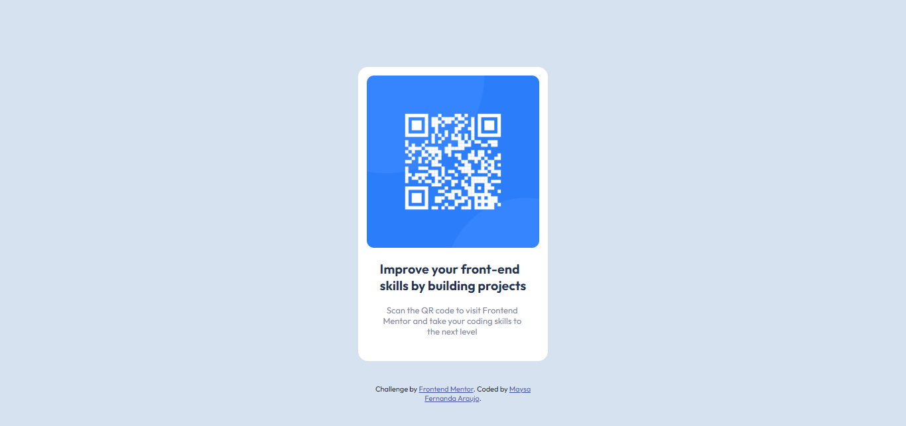

# Frontend Mentor - QR code component solution

This is a solution to the [QR code component challenge on Frontend Mentor](https://www.frontendmentor.io/challenges/qr-code-component-iux_sIO_H). Frontend Mentor challenges help you improve your coding skills by building realistic projects.

## Table of contents

- [Frontend Mentor - QR code component solution](#frontend-mentor---qr-code-component-solution)
  - [Table of contents](#table-of-contents)
  - [Overview](#overview)
    - [Screenshot](#screenshot)
    - [Links](#links)
  - [Author](#author)

## Overview

### Screenshot

### Links

- Live Site URL: [Click Here](https://qr-code-frontend-q.netlify.app/)

## Author

- GitHub: [@maysaraujo](https://github.com/maysaraujo)
